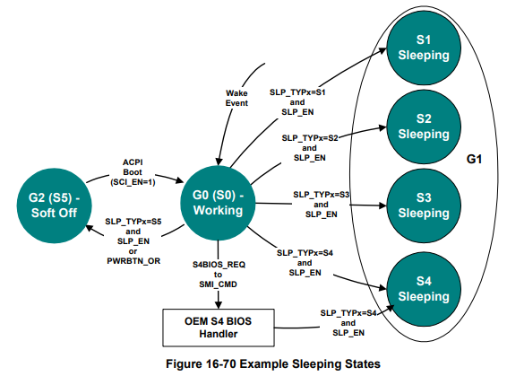
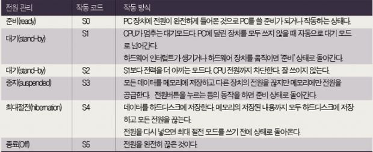

# 2021-07-07 (ACPI)

### ACPI란

> **고급 구성 및 전원 인터페이스**(Advanced Configuration and Power Interface, ACPI) 규격은 [HP](https://ko.wikipedia.org/wiki/휴렛_팩커드), [인텔](https://ko.wikipedia.org/wiki/인텔), [마이크로소프트](https://ko.wikipedia.org/wiki/마이크로소프트), [피닉스](https://ko.wikipedia.org/w/index.php?title=피닉스_(기업)&action=edit&redlink=1), 그리고 [도시바](https://ko.wikipedia.org/wiki/도시바)가 개발하고, 1996년 12월에 처음 공개된 최초의 [오픈 표준](https://ko.wikipedia.org/wiki/오픈_표준)이다. 하드웨어 감지, 메인보드 및 장치 구성, [전원 관리](https://ko.wikipedia.org/w/index.php?title=전원_관리&action=edit&redlink=1)를 담당하는 일반적인 인터페이스를 정의한다. 이 규격[[1\]](http://www.acpi.info/spec.htm)에 따르면, "ACPI는 OSPM 안의 주 구성 요소이다."

https://ko.wikipedia.org/wiki/ACPI

> ACPI provides a crossover from earlier standards to hardware that is completely ACPI-compliant. Geared toward substituting the plug and play (PnP) basic input/output system (BIOS) specification, multiprocessor specification and advanced power management, the ACPI standard delivers power to operating system power management (OSPM), in contrast to earlier BIOS central systems that primarily depend on platform specific firmware to determine power management and configuration policy.
>
> ACPI includes various related components for software and hardware programming, as well as a unified standard for power/device interaction and bus configuration. With ACPI, the following functions are feasible, presuming they are supported by the OS:

https://www.techopedia.com/definition/4962/advanced-configuration-and-power-interface-acpi

### ACPI 5.1 공식 문서

16 챕터에 Sleeping States 있음

https://uefi.org/sites/default/files/resources/ACPI_5_1release.pdf

https://uefi.org/specifications

ACPI level에 대해 잘 설명한 문서

> **ACPI** **레벨에** **의한** **구분**
>
> ACPI 레벨은 다음과 같이 구분됩니다.
>
> \- Global States(전역 상태)
>
> \- Suspend States(절전 상태)
>
> \- Processor States(프로세서 상태)
>
> \- Device States(장치 상태)
>
> 흔히 절전 상태를 기준으로 레벨을 이야기하게 됩니다.
>
>  
>
> **전역** **상태**(Global States)에 의한 구분
>
> G0 : 전원이 켜져 있으며 정상적으로 작동중입니다. 흔히 컴퓨터가 켜져있다고 하면 이 레벨입니다.(S0)
>
> G1 : 절전 상태입니다. 전력을 절약하기 위해 시스템을 절전 상태로 돌립니다. (S1 ~ S4)
>
> G2 : 전원이 꺼져있는 상태입니다. 흔히 Soft Off라고 합니다. PS2, USB, 랜 등에는 계속 전원이 공급되며 이들을 사용하여 PC의 전원을 다시 켤 수 있습니다. S4는 공식적으로는 G1에 해당됩니다만 G2로 볼 수도 있습니다. (S5)
>
> G3 : 전원이 꺼져있는 것은 물론, 파워 서플라이가 메인보드에 전원을 공급하지 않습니다. 흔히 컴퓨터를 종료하고 코드를 뽑거나 멀티탭의 전원을 차단하는 것을 말합니다. Mechanical Off라고도 합니다. (S6)
>
>  
>
> **절전** **상태**(Suspend States)에 의한 구분
>
> \- 절전 모드 : 일반적으로 S1, S3, S4를 말합니다. 흔히 바이오스에서 S1(POS), S3(STR)에 대한 설정을 보실 수 있습니다. 호환성 문제로 상당수의 보드 회사들이 기본값을 S1로 설정해놓습니다만, 절전 효과를 원하는 사용자들은 S3를 사용합니다. S2는 보통 지원되지 않습니다.
>
> S1 : Power On Suspend. 컴퓨터가 켜진 상태에서 디스크(HDD,ODD..)와 모니터 등의 입출력장치의 전원을 차단합니다. S1의 절전 모드에서는 CPU의 팬이 여전히 동작하고 있는 것을 보실 수 있습니다. CPU,RAM,VGA 등의 핵심 부품들이 정상 작동하기에 절전 효과는 그렇게 크지 않습니다.
>
> S3 : Suspend To Ram. 램의 내용만을 보존하고 나머지 장치 대부분의 전원을 차단합니다. 램의 갱신은 최대한 절제되며 램에 전원을 공급하기 위해 5V 레일에서만 전력을 끌어오게 됩니다. 절전 효과가 매우 크나(S4에 근접) 시스템 내의 장치들이 이를 잘 지원해줘야 하며 지원해주지 못할 경우오류가 발생하기 쉽습니다. S3 절전 모드로 진입할 시에는 CPU 팬이 꺼지게 됩니다. (바이오스에서 조정 가능)
>
> S2 : S1과 S3의 중간쯤 되는 모드로 CPU 전원은 차단되지만 램의 갱신은 정상적으로 이루어집니다.
>
> \- 최대 절전 모드
>
> S4 : Suspend To Disk. 램의 내용을 하드디스크에 저장한 뒤에 시스템의 전원을 완전히 차단합니다. 후에 다시 시스템을 켤 경우 하드디스크에 저장된 데이터를 램에 다시 복구하여 상태를 복원합니다. 전원이 완전히 차단되므로 절전 효과가 가장 큽니다.
>
> S3+S4 : 혼성 절전 모드(Hybrid Sleep Mode). 비스타에 도입된 절전 모드입니다. 노트북을 절전모드로 두고 깜빡 잊어버렸을 경우 배터리가 방전되어 작업중인 데이터를 모두 날려버리는 경우가 있습니다.
>
> 혼성 모드는 이를 방지하기 위해 메모리의 내용을 하드디스크에 저장한 후 절전 모드(S1이나 S3)로 빠지게 됩니다. 안전하다는 장점이 있으나 절전 모드 진입 속도가 S1,S3에 비해 느리다는 단점이 있습니다.
>
> \- 기타
>
> S0 : 전원이 켜져있는 상태입니다.
>
> S5 : 전원이 꺼져있는 상태입니다. 흔히 Soft Off라고 합니다.
>
> S6 : 전원이 꺼져있는 것은 물론, 파워 서플라이가 메인보드에 전원을 공급하지 않습니다. S6은 공식 레벨은 아닙니다만 편이상 존재하는 레벨입니다.

https://m.blog.naver.com/pinokyo75/120037232267

NCR ACPI level

> ### ACPI Sleep States (S0 - S5)
>
> Under the G1 sleeping state ACPI defines levels of system sleep state support. The 7613 supports the following sleeping states:
>
> •S0: Normal Powered-On state
>
> •S1 (Standby): The S1 sleeping state is a low wake latency sleeping state. In this state, no system context is lost (CPU or chip set) and hardware maintains all system contexts.
>
> **Note:**  The 7613 does not support S1 state. Turning off the backlight and hard drives provides the equivalent power savings (due to Intel's processor C-states feature) at nearly zero latency.
>
> •S2: Not supported
>
> •S3 (Suspend to Ram): The S3 sleeping state is a low wake latency sleeping state. This state is similar to the S1 sleeping state except that the CPU and system cache context is lost (the OS is responsible for maintaining the caches and CPU context). Control starts from the processor's reset vector after the wake event. In NCR systems, during S3, power is only provided to the USB 3.0 ports.
>
> **Note:**  When the terminal resumes from an S3 state, all the USB devices re-enumerate. This causes speaker tones as if they were disconnected and then reconnected. This does not present a problem and the USB devices will continue to operate correctly.
>
> Requirements for S3 support:
>
> •O/S must be built on a system with S3 enabled in the BIOS
>
> •Some peripherals may not be S3 capable, which can prevent the system from entering S3 state.
>
> •S4 (Suspend to Disk): The S4 state is the lowest power, longest wake latency sleeping state supported by ACPI. In order to reduce power to a minimum, it is assumed that the hardware platform has powered off all devices. Platform context is maintained.
>
> Requirements for S4 support:
>
> •O/S must be built on a system with S3 enabled in the BIOS
>
> •Some peripherals may not be S4 capable, which can prevent the system from entering S4 state.
>
> Reference the *ACPI Specification* for details.

https://onlinehelp.ncr.com/Retail/Workstations/7613/HTML/Topics/UserGuide/5.%20Power%20Management/3-ACPI%20Sleep%20States%20(S0%20-%20S5).htm

Q. ACPI와 PSCI의 관련성?

PSCI는 DVFS같은 power management 기법은 다루지 못한다 -> 이건 SCMI에서

> The interface does not cover Dynamic Voltage and Frequency Scaling (DVFS) or device power management (for example, management of peripherals, such as GPUs). [System Control and Management Interface (SCMI)](https://developer.arm.com/architectures/system-architectures/software-standards/scmi) does provide standard interfaces for this purpose.

https://developer.arm.com/architectures/system-architectures/software-standards/psci

### 윈도우7에서의 ACPI

http://www.ilovepc.co.kr/news/articleView.html?idxno=2662

### ACPI의 목적

> **ACPI** is an acronym that stands for Advanced Configuration and Power Interface, a power management specification developed by Intel, Microsoft, and Toshiba. ... **ACPI** is designed to allow the operating system to control the amount of power provided to each device or peripheral attached to the computer system.2018. 1. 18.

https://kb.iu.edu/d/ahvl

