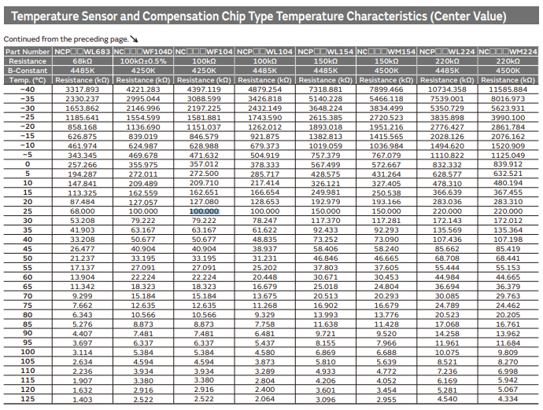
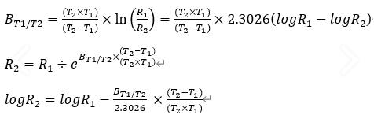

---

---

# 2021-06-04 (Thermistor & ADC)

### ADC를 사용해서 Thermistor를 읽는 방법

전압 분배법칙을 이용하기 위해 R1에 Thermistor용 저항을 단다. 그러면 이것은 온도가 낮아지면 저항이 커지고, 온도가 높아지면 저항이 작아진다. R2는 고정이다. 100K 등 값이 정해져있다. R25 = 100 K 이런 스펙이 주어지면 이건 R1을 말한다. 25도일 때 저항이 100000 옴이란 뜻이다.

(R2랑 Vout 부분은 물이 아래로 떨어지는 걸 생각할 때 전류는 R2는 지나가기 힘든 길이라 Vout에 더 많이 지나갈 수 있는 걸 상상할 수 있다 -> 이렇게 보면 안 되고, 공식으로 계산해보면, Vin 에서 Ground 까지 R1 + R2 저항을 지나서 흐른다. 그러면 Vin - 0 = I * (R1+R2) 가 나오고 Vin - Vout = I * (R1) 이 나온다. 이걸 계산해보면 전압 분배법칙 공식이 나온다. 혹은 (Vin-0) : (Vin - Vout) = (R1 + R2) : R1 으로 비례식을 세워서 계산해도 나온다.)

murata thermistor 제품을 사용한다면 murata data sheet를 참고하면 아래와 같이 온도에 따른 저항값 표를 이용할 수 있다.

(18 페이지)

https://www.murata.com/~/media/webrenewal/support/library/catalog/products/thermistor/ntc/r44e.ashx

그리고 만약 1.8 V Vin일 때 12 bit ADC로 이 Vout을 읽는다면 값 * 4095 / 1.8 로 계산할 수 있다. (만약 10 bit ADC라면 값 * 1023 / 1.8 이 된다.)

| Temp | Resistance (kΩ) | R2 (kΩ) | Vin (V) | Vout (R2 / (R1+R2) * Vin) (V) | 12 bit ADC value |
| ---- | --------------- | ------- | ------- | ----------------------------- | ---------------- |
| 20   | 127.080         | 100     | 1.8     | 0.79267                       | 1803.3           |
| 25   | 100             |         |         | 0.9                           | 2047.5           |
| 30   | 79.222          |         |         | 1.004                         | 2284.1           |

###  B value

B value는 저항 온도 그래프에서 두 지점간 기울기를 뜻하는데, 온도에 얼마나 민감하게 반응하는지 특성을 나타내는 상수로 제품 스펙 상에 표기된다. 위의 표를 이용하는 방식 말고 B value를 이용하여 계산하는 방식도 있다.

https://setoo0922.tistory.com/253

https://openstory.tistory.com/230

### NTC

저항의 온도 계수에 따라 써미스터는 크게 두 종류로 구분할 수 있다.

(1) PTC: Positive Temperature Coefficient 저항이 온도 증가에 따라 증가함

(2) NTC: Negative Temperature Coefficient 저항이 온도 증가에 따라 감소함

https://openstory.tistory.com/157