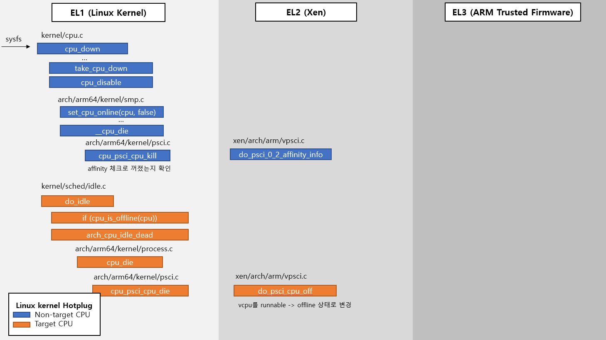
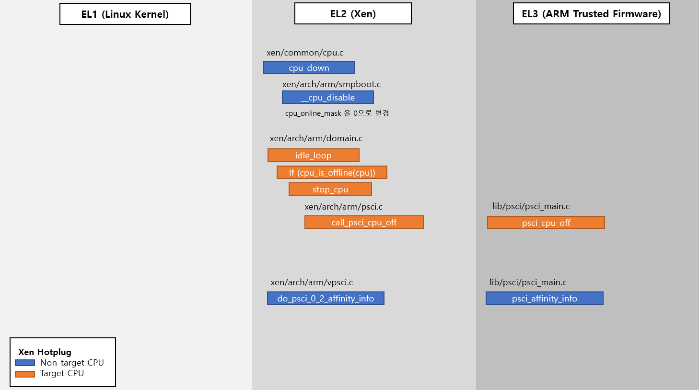

# 2021-11-22 (Linux CPU hotplug path)

코드에 dump_stack(); 을 포함하면 아래와 같이 sysfs 호출시 결과를 확인할 수 있다.

cpu on 및 off 호출시 결과

```shell
# echo 0 > /sys/devices/system/cpu/cpu1/online
[  364.027309] [  365.953232]  [1:             sh: 1958] CPU: 1 PID: 1958 Comm: sh Tainted: G        W       4.14.137-00105-gd6181fe-dirty #1
[  364.027417] [  365.953338]  [1:             sh: 1958] Hardware name: AEMv8A (DT)
[  364.027478] [  365.953399]  [1:             sh: 1958] Call trace:
[  364.030916] [  365.956837]  [1:             sh: 1958] [<ffffff800808a760>] dump_backtrace+0x0/0x3f0
[  364.039934] [  365.965856]  [1:             sh: 1958] [<ffffff800808ab64>] show_stack+0x14/0x20
[  364.048615] [  365.974536]  [1:             sh: 1958] [<ffffff80088ec340>] dump_stack+0x9c/0xbc
[  364.057293] [  365.983214]  [1:             sh: 1958] [<ffffff80080a58c8>] cpu_down+0x14/0x2c
[  364.065802] [  365.991723]  [1:             sh: 1958] [<ffffff800853ede8>] cpu_subsys_offline+0x10/0x18
[  364.075174] [  366.001096]  [1:             sh: 1958] [<ffffff8008539e28>] device_offline+0x98/0xc8
[  364.084198] [  366.010119]  [1:             sh: 1958] [<ffffff8008539f24>] online_store+0x3c/0x88
[  364.093053] [  366.018974]  [1:             sh: 1958] [<ffffff80085366d8>] dev_attr_store+0x18/0x28
[  364.102084] [  366.028005]  [1:             sh: 1958] [<ffffff80082a8180>] sysfs_kf_write+0x40/0x58
[  364.111106] [  366.037027]  [1:             sh: 1958] [<ffffff80082a743c>] kernfs_fop_write+0xcc/0x1e0
[  364.120398] [  366.046319]  [1:             sh: 1958] [<ffffff800822d740>] __vfs_write+0x18/0x118
[  364.129247] [  366.055169]  [1:             sh: 1958] [<ffffff800822da1c>] vfs_write+0xa4/0x188
[  364.137927] [  366.063848]  [1:             sh: 1958] [<ffffff800822dcc4>] SyS_write+0x4c/0xb8
[  364.146521] [  366.072442]  [1:             sh: 1958] Exception stack(0xffffff800ce33ec0 to 0xffffff800ce34000)
[  364.156588] [  366.082510]  [1:             sh: 1958] 3ec0: 0000000000000001 000000557048fa40 0000000000000002 0000007fb2f68f68
[  364.168044] [  366.093966]  [1:             sh: 1958] 3ee0: 0000000000000000 5551000454000000 0000000000000001 0000005570467010
[  364.179502] [  366.105423]  [1:             sh: 1958] 3f00: 0000000000000040 0000007fb2fdf710 0000000000001030 0000000000000001
[  364.190959] [  366.116880]  [1:             sh: 1958] 3f20: 0000000000000002 0000000000000000 0000000000000000 0000000000000001
[  364.202417] [  366.128338]  [1:             sh: 1958] 3f40: 00000055636fa908 0000007fb2e68540 0000000000000fff 0000000000000001
[  364.213875] [  366.139796]  [1:             sh: 1958] 3f60: 000000557048fa40 0000007fb2f65588 0000000000000002 000000557048fa40
[  364.225332] [  366.151253]  [1:             sh: 1958] 3f80: 0000000000000002 0000007fb2f65670 00000055636c4000 0000000000000000
[  364.236790] [  366.162711]  [1:             sh: 1958] 3fa0: 00000055636fb000 0000007fcebb37c0 0000007fb2e6b930 0000007fcebb37c0
[  364.248247] [  366.174168]  [1:             sh: 1958] 3fc0: 0000007fb2ebd42c 0000000020000000 0000000000000001 0000000000000040
[  364.259704] [  366.185626]  [1:             sh: 1958] 3fe0: 0000000000000000 0000000000000000 0000000000000000 0000000000000000
[  364.271163] [  366.197084]  [1:             sh: 1958] [<ffffff8008083b18>] __sys_trace_return+0x0/0x4
[  364.311312] [  366.237235]  [1:    migration/1:   16] IRQ 30: no longer affine to CPU1
[  364.311454] [  366.237376]  [0:             sh: 1958] CPU1: shutdown
[  364.311586] [  366.237507]  [0:             sh: 1958] psci: CPU1 killed.

# echo 1 > /sys/devices/system/cpu/cpu1/online
[  369.896758] [  371.822681]  [0:             sh: 1958] CPU: 0 PID: 1958 Comm: sh Tainted: G        W       4.14.137-00105-gd6181fe-dirty #1
[  369.896867] [  371.822788]  [0:             sh: 1958] Hardware name: AEMv8A (DT)
[  369.896928] [  371.822849]  [0:             sh: 1958] Call trace:
[  369.900365] [  371.826287]  [0:             sh: 1958] [<ffffff800808a760>] dump_backtrace+0x0/0x3f0
[  369.909379] [  371.835301]  [0:             sh: 1958] [<ffffff800808ab64>] show_stack+0x14/0x20
[  369.918060] [  371.843981]  [0:             sh: 1958] [<ffffff80088ec340>] dump_stack+0x9c/0xbc
[  369.926740] [  371.852662]  [0:             sh: 1958] [<ffffff80080a589c>] cpu_up+0x14/0x2c
[  369.935074] [  371.860995]  [0:             sh: 1958] [<ffffff800853ee38>] cpu_subsys_online+0x48/0xa0
[  369.944359] [  371.870280]  [0:             sh: 1958] [<ffffff8008539ec4>] device_online+0x6c/0x90
[  369.953297] [  371.879218]  [0:             sh: 1958] [<ffffff8008539f68>] online_store+0x80/0x88
[  369.962152] [  371.888073]  [0:             sh: 1958] [<ffffff80085366d8>] dev_attr_store+0x18/0x28
[  369.971182] [  371.897104]  [0:             sh: 1958] [<ffffff80082a8180>] sysfs_kf_write+0x40/0x58
[  369.980204] [  371.906125]  [0:             sh: 1958] [<ffffff80082a743c>] kernfs_fop_write+0xcc/0x1e0
[  369.989497] [  371.915418]  [0:             sh: 1958] [<ffffff800822d740>] __vfs_write+0x18/0x118
[  369.998346] [  371.924267]  [0:             sh: 1958] [<ffffff800822da1c>] vfs_write+0xa4/0x188
[  370.007025] [  371.932947]  [0:             sh: 1958] [<ffffff800822dcc4>] SyS_write+0x4c/0xb8
[  370.015620] [  371.941541]  [0:             sh: 1958] Exception stack(0xffffff800ce33ec0 to 0xffffff800ce34000)
[  370.025690] [  371.951611]  [0:             sh: 1958] 3ec0: 0000000000000001 000000557048fa40 0000000000000002 0000007fb2f68f68
[  370.037145] [  371.963067]  [0:             sh: 1958] 3ee0: 0000000000000000 5551000454000000 0000000000000001 0000000000000031
[  370.048603] [  371.974524]  [0:             sh: 1958] 3f00: 0000000000000040 0000000000000001 0000007fcebb3780 0000000000000000
[  370.060061] [  371.985982]  [0:             sh: 1958] 3f20: 0000000000000000 0000000000000018 0000000000000000 0000000000000020
[  370.071519] [  371.997440]  [0:             sh: 1958] 3f40: 00000055636fa908 0000007fb2e68540 000000000000001f 0000000000000001
[  370.082977] [  372.008898]  [0:             sh: 1958] 3f60: 000000557048fa40 0000007fb2f65588 0000000000000002 000000557048fa40
[  370.094433] [  372.020354]  [0:             sh: 1958] 3f80: 0000000000000002 0000007fb2f65670 00000055636c4000 0000000000000000
[  370.105891] [  372.031812]  [0:             sh: 1958] 3fa0: 00000055636fb000 0000007fcebb37c0 0000007fb2e6b930 0000007fcebb37c0
[  370.117349] [  372.043270]  [0:             sh: 1958] 3fc0: 0000007fb2ebd42c 0000000020000000 0000000000000001 0000000000000040
[  370.128806] [  372.054727]  [0:             sh: 1958] 3fe0: 0000000000000000 0000000000000000 0000000000000000 0000000000000000
[  370.140265] [  372.066186]  [0:             sh: 1958] [<ffffff8008083b18>] __sys_trace_return+0x0/0x4
(XEN) [  372.098125] printk: 15 messages suppressed.
(XEN) [  372.102811] d0v1: vGICD: unhandled word write 0x000000ffffffff to ICACTIVER0
[  370.155432] [  372.081354]  [1:      swapper/1:    0] Detected VIPT I-cache on CPU1
[  370.183990] [  372.109911]  [1:      swapper/1:    0] CPU1: Booted secondary processor [411fd050]
```

dump_stack(); 을 삽입한 위치

```c
// kernel/cpu.c

int cpu_down(unsigned int cpu)
{
    dump_stack();
    return do_cpu_down(cpu, CPUHP_OFFLINE);
}

int cpu_up(unsigned int cpu)
{
    dump_stack();
    return do_cpu_up(cpu, CPUHP_ONLINE);
}
```

dump_stack() 에 대한 설명

http://egloos.zum.com/rousalome/v/9992691


### 리눅스 커널의 구조와 원리 저자 유튜브

https://www.youtube.com/user/schezokim


### Linux System Call Table

https://thevivekpandey.github.io/posts/2017-09-25-linux-system-calls.html


(2021.12.17 내용 추가)

kernel 에서 CPU Hotplug out sysfs node 명령어를 입력하였을 때 (위의 예시 참고),

해당 CPU 가 idle 루프에 들어가게 되면 EL2 (가상화가 아니라면 EL3로) 로 cpu 를 끄는 psci 가 내려간다.

하지만 xen 에서는 실제로 power를 끄지는 않는다.




xen 코드 내에서는 CPU Hotplug driver가 보이지 않는다.

S2R 할 때 사용할 수 있는 루트는 보인다. non boot cpu 들을 끄는 함수에서 cpu_down 을 호출하고, 그러면 kernel 과 같은 방식으로 (xen 이 kernel 을 베이스로 만들어져서) 해당 CPU가 idle 에 진입하였을 때, EL3로 cpu off psci 가 전달된다.




